```mermaid
graph TD
    %% Clear Top-Down Structure
    
    %% Layer 1: User Interface
    User["👤 User"]
    
    %% Layer 2: Orchestrator
    User --> AgentSquad["🎯 AgentSquad"]
    AgentSquad --> Classifier["🧠 OpenAI Classifier"]
    
    %% Layer 3: Agents
    Classifier --> RepoAgent["📋 Repo Map Agent"]
    Classifier --> PackageAgent["🔧 Package Compatibility Agent"]
    Classifier --> CodexAgent["🐳 Codex Agent"]
    
    %% Layer 4: Tools
    RepoAgent --> RepoTools["🗺️ Repo Map Tools"]
    PackageAgent --> PackageTools["🛠️ Package Tools"]
    CodexAgent --> CodexTools["⚙️ Codex CLI Tools"]
    
    %% Layer 5: Core Functions
    RepoTools --> RepoFunc["🌳 get_repo_map"]
    PackageTools --> PackageFunc["📦 analyze_package_formatted"]
    CodexTools --> CodexFunc["🔧 execute_codex_query"]
    
    %% Layer 6: External Systems
    RepoFunc --> AiderSys["🔍 Aider System"]
    PackageFunc --> CompatSys["🔗 Compat System"]
    CodexFunc --> DockerSys["🐋 Docker System"]
    
    %% Environment Setup Flow (Moved to the right with feedback loop)
    subgraph Setup_Flow["🔄 Environment Setup Workflow"]
        direction TB
        Step1["1. Project Analysis"] --> Step2["2. Dependency Check"]
        Step2 --> Step3["3. Dockerfile Creation"]
        Step3 --> Step4["4. Environment Build"]
        Step4 --> Step5["5. Testing & Verification"]
        
        %% Feedback Loop
        Step5 --> Feedback{"✅ All Tests Pass?"}
        Feedback -->|"No ❌"| Adjust["🔄 Adjust Configuration"]
        Adjust --> Step3
        Feedback -->|"Yes ✅"| Complete["🎉 Setup Complete"]
        
        %% Verification Steps
        subgraph Verify ["🔍 Verification Process"]
            V1["Import Test"]
            V2["Basic Run Test"]
            V3["Integration Test"]
        end
        
        Step5 --- Verify
    end
    
    %% API Connection
    subgraph API_Channel["☁️ OpenAI API Channel"]
        OpenAIAPI["gpt-4o"]
    end
    
    Classifier -.-> OpenAIAPI
    RepoAgent -.-> OpenAIAPI
    PackageAgent -.-> OpenAIAPI
    CodexAgent -.-> OpenAIAPI
    
    %% Layer Labels
    User -.-> L1["📍 Layer 1: User Interface"]
    AgentSquad -.-> L2["📍 Layer 2: Orchestration"]
    RepoAgent -.-> L3["📍 Layer 3: Agent Processing"]
    RepoTools -.-> L4["📍 Layer 4: Tool Integration"]
    RepoFunc -.-> L5["📍 Layer 5: Core Functions"]
    AiderSys -.-> L6["📍 Layer 6: External Services"]
    
    %% Styling
    classDef layer1 fill:#e8f5e8,stroke:#4caf50,stroke-width:4px
    classDef layer2 fill:#e3f2fd,stroke:#2196f3,stroke-width:3px
    classDef layer3 fill:#fff3e0,stroke:#ff9800,stroke-width:3px
    classDef layer4 fill:#f3e5f5,stroke:#9c27b0,stroke-width:2px
    classDef layer5 fill:#e0f2f1,stroke:#009688,stroke-width:2px
    classDef layer6 fill:#fce4ec,stroke:#e91e63,stroke-width:2px
    classDef flow fill:#f5f5f5,stroke:#757575,stroke-width:2px,stroke-dasharray: 5 5
    classDef verify fill:#fff8e1,stroke:#ffa000,stroke-width:2px
    classDef feedback fill:#e8eaf6,stroke:#3f51b5,stroke-width:2px
    classDef api fill:#f5f5f5,stroke:#757575,stroke-width:1px
    classDef label fill:#ffffff,stroke:#cccccc,stroke-width:1px,color:#666
    
    class User layer1
    class AgentSquad,Classifier layer2
    class RepoAgent,PackageAgent,CodexAgent layer3
    class RepoTools,PackageTools,CodexTools layer4
    class RepoFunc,PackageFunc,CodexFunc layer5
    class AiderSys,CompatSys,DockerSys layer6
    class Step1,Step2,Step3,Step4,Step5 flow
    class V1,V2,V3 verify
    class Feedback,Adjust feedback
    class OpenAIAPI api
    class L1,L2,L3,L4,L5,L6 label
```

# Environment Setup Architecture

This diagram illustrates the complete architecture of our environment setup system, including:

1. **System Layers**
   - User Interface (Layer 1)
   - Orchestration (Layer 2)
   - Agent Processing (Layer 3)
   - Tool Integration (Layer 4)
   - Core Functions (Layer 5)
   - External Services (Layer 6)

2. **Key Components**
   - AgentSquad Orchestrator
   - OpenAI Classifier
   - Specialized Agents (Repo Map, Package Compatibility, Codex)
   - Tool Integration Layer
   - Core Functionality
   - External System Integration

3. **Environment Setup Workflow**
   - Project Analysis
   - Dependency Check
   - Dockerfile Creation
   - Environment Build
   - Testing & Verification
   - Feedback Loop for Continuous Improvement

4. **Verification Process**
   - Import Testing
   - Basic Run Testing
   - Integration Testing
   - Pass/Fail Feedback Loop
   - Configuration Adjustment Mechanism

5. **API Integration**
   - OpenAI GPT-4 Integration
   - Agent-API Communication
   - External Service Connections 