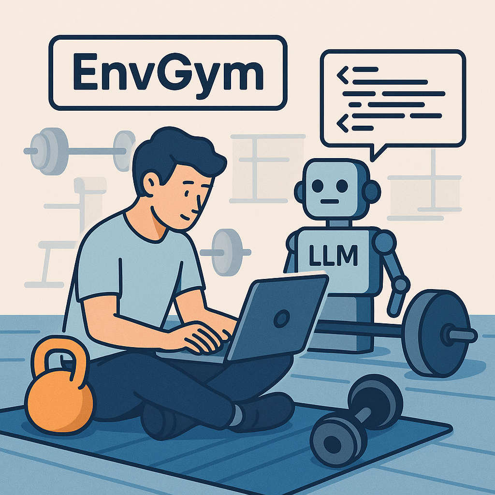
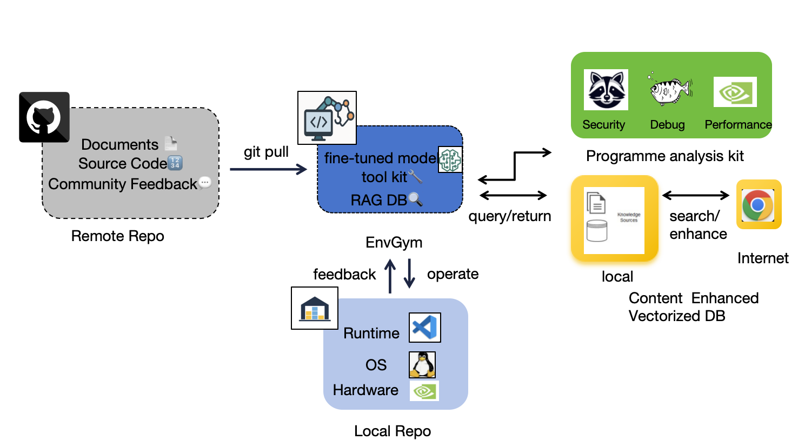
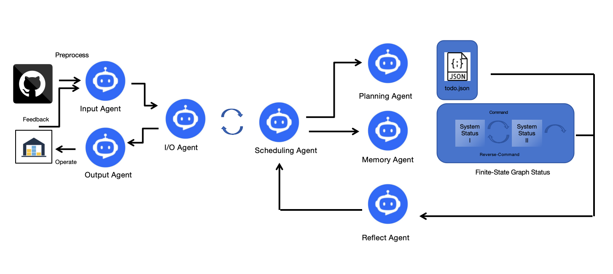

# 🤖 EnvGym: A Multi-Agent Framework for Reproducing Research Prototypes

      
  
    
    
    

EnvGym is a **general multi-agent framework** designed to **automatically construct executable environments** for reproducing research prototypes from **top-tier academic conferences and journals**.Despite the growing interest in reproducibility, setting up research environments is still **time-consuming and error-prone**. EnvGym tackles this by building a **generalizable agentic system** to automate environment setup—reducing human effort while increasing reliability and repeatability.

Our system leverages the power of **Large Language Model (LLM) agents** to analyze project instructions, resolve dependencies, configure environments, and validate successful execution.

## 🚀 Key Design

## 🚀 Key Features

- ⚙️ **Automatic Environment Construction**  
  Converts research repository instructions into executable environments end-to-end.

- 🤖 **LLM-Powered Agents**  
  Agents use large language models to interpret README files, resolve dependencies, and run setup commands.

- 📐 **Verifiable Rubrics**  
  Fine-grained, programmable evaluation criteria to check correctness and completeness of reproduction.

- ✅ **Auto & Human Evaluation**  
  Automatic LLM-based evaluators, validated by human experts, to ensure execution fidelity.

- 🧩 **Extensible & Modular Design**  
  Built to easily incorporate new agent workflows and debugging tools.

---

## 📂 Repository Structure (WIP)

---

## 📄 Citation (Coming Soon)

We will release a preprint and BibTeX citation for academic use shortly.

---

## 🤝 Contributing

We welcome contributions! Please open issues, submit pull requests, or contact us for collaboration.

---

## 📬 Contact

- **Yiming Cheng** – [GitHub](https://github.com/EaminC) | eaminchan@uchicago.edu
- **Binrui Huang** – [GitHub](https://github.com/samloveshoneywater) | binruih@uchicago.edu

---

## 📜 License

MIT License. See [LICENSE](./LICENSE.md) for details.
