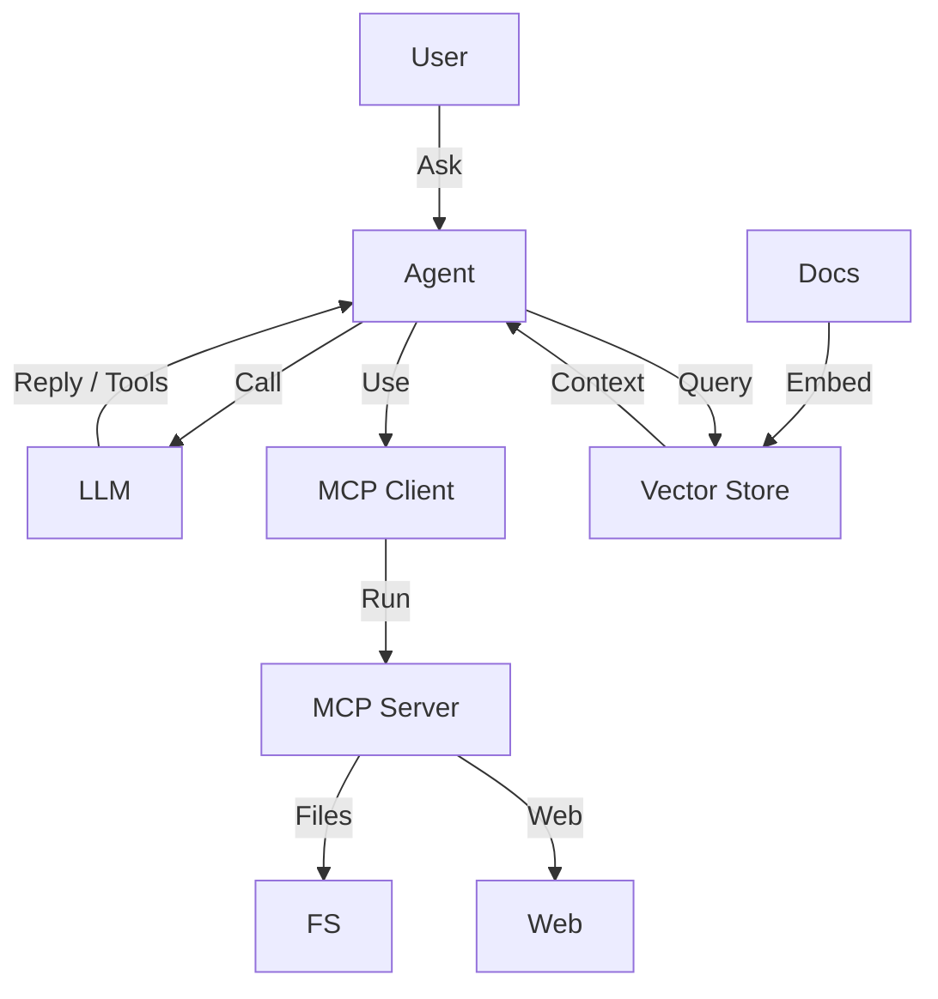

```mermaid
graph TD
    A[User] -->|Ask| B[Agent]
    B -->|Call| C[LLM]
    C -->|Reply / Tools| B
    B -->|Use| D[MCP Client]
    D -->|Run| E[MCP Server]
    E -->|Files| F[FS]
    E -->|Web| G[Web]
    H[Docs] -->|Embed| I[Vector Store]
    B -->|Query| I
    I -->|Context| B
```
